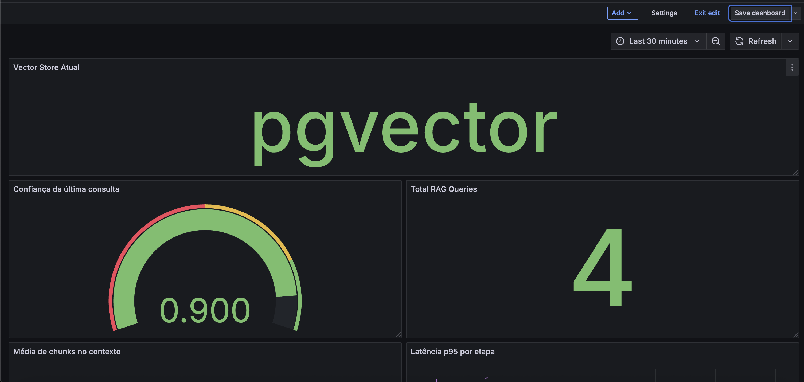

# RAG Project

A Retrieval-Augmented Generation (RAG) platform built for learning and experimentation with modern GenAI architectures.

The project supports multiple document formats, multiple vector stores, hybrid retrieval strategies, evaluation pipelines, REST APIs, Docker environments, and CI/CD automation.

---

## Features

### Data Ingestion

- PDF Loader
- DOCX Loader
- Image Loader (OpenAI Vision)
- Automatic chunking
- Parent-child document structure

### Retrieval

- Vector Search
- BM25 Search
- Hybrid Search
- Metadata Filtering
- Parent Retrieval
- Neighbor Retrieval
- Context Expansion
- Reranking

### Vector Stores

- ChromaDB
- Qdrant
- PostgreSQL + pgvector
- OpenSearch

### API

- FastAPI
- OpenAPI / Swagger

### Infrastructure

- Docker
- Docker Compose

### Quality

- Evaluation Framework
- Confidence Score
- GitHub Actions CI/CD


## Hybrid Search Modes

### Local Hybrid Search

Used by:

- ChromaDB
- Qdrant
- PostgreSQL + pgvector

Pipeline:

Vector Search
→ BM25
→ Hybrid Ranking
→ Reranker

### OpenSearch Native Hybrid Search

Used by:

- OpenSearch

Pipeline:

BM25
+ Vector Search
+ Score Fusion
→ Reranker

---

## Architecture

```txt
Documents
    │
    ▼
Loaders
(PDF / DOCX / Images)
    │
    ▼
Chunking
    │
    ▼
OpenAI Embeddings
    │
    ▼
Vector Store
(Chroma / Qdrant / pgvector / OpenSearch)
    │
    ▼
Hybrid Retrieval
(Vector + BM25)
    │
    ▼
Reranker
    │
    ▼
Parent Retrieval
    │
    ▼
Context Builder
    │
    ▼
OpenAI Responses API
```

---

## Prerequisites

- Python 3.13+
- OpenAI API Key
- Docker (optional)

---

## Installation

Clone the repository:

```bash
git clone <repository>
cd rag-project
```

Create a virtual environment:

```bash
python -m venv .venv
```

Activate it:

### macOS / Linux

```bash
source .venv/bin/activate
```

### Windows

```bash
.venv\Scripts\activate
```

Install dependencies:

```bash
pip install -e ".[dev]"
```

---

## OpenAI Configuration

Create a `.env` file:

```env
OPENAI_API_KEY=your_api_key
```

Example:

```env
OPENAI_API_KEY=sk-xxxxxxxxxxxxxxxxxxxxxxxx
```

---

## Supported File Types

Place your files in:

```txt
data/raw/
```

Example:

```txt
data/raw/
├── document.pdf
├── document.docx
└── image.jpg
```

Supported formats:

- PDF
- DOCX
- JPG
- JPEG
- PNG

---

# Vector Store Configuration

The project supports multiple vector-store backends.

Choose one:

### ChromaDB

```bash
export VECTOR_STORE=chroma
```

### Qdrant

```bash
export VECTOR_STORE=qdrant
```

### PostgreSQL + pgvector

```bash
export VECTOR_STORE=pgvector
```

### OpenSearch

```bash
export VECTOR_STORE=opensearch
```

---

## Supported Vector Stores

| Backend | Status |
|----------|----------|
| ChromaDB | ✅ |
| Qdrant | ✅ |
| PostgreSQL + pgvector | ✅ |
| OpenSearch | ✅ |

---

# Document Ingestion

Generate embeddings and index documents:

```bash
python -m app.ingest
```

Example:

```txt
document.pdf: 5 chunks indexed
document.docx: 3 chunks indexed
image.jpg: 1 chunk indexed
```

---

# Querying Documents

Run:

```bash
python -m app.query
```

Example:

```txt
Question:
What movie is mentioned?
```

Exit:

```txt
exit
```

or

```txt
quit
```

---

# Evaluation Framework

The project contains an automated evaluation suite validating:

- Retrieval
- Reranking
- Answer Quality
- Metadata Filtering

Run:

```bash
python -m tests.evaluate
```

Example:

```txt
Summary:
Total: 15
Retrieval: 15/15
Rerank: 15/15
Answer: 15/15
Overall: 15/15
Score: 100%
```

---

# Vector Store Benchmark

Current benchmark results:

| Backend | Retrieval | Rerank | Answer | Overall |
|----------|----------|----------|----------|----------|
| ChromaDB | 15/15 | 15/15 | 15/15 | 15/15 |
| Qdrant | 15/15 | 15/15 | 15/15 | 15/15 |
| PostgreSQL + pgvector | 15/15 | 15/15 | 15/15 | 15/15 |
| OpenSearch | 15/15 | 15/15 | 15/15 | 15/15 |

---

# Reset Vector Store

Reset the selected backend:

```bash
python reset_vector_store.py
```

Re-ingest the documents:

```bash
python -m app.ingest
```

---

# FastAPI

Run locally:

```bash
uvicorn app.api.main:app --reload
```

Swagger UI:

```txt
http://localhost:8000/docs
```

---

## API Endpoints

### Health Check

```http
GET /health
```

### Query Documents

```http
POST /query
```

Example:

```bash
curl -X POST \
  http://localhost:8000/query \
  -H "Content-Type: application/json" \
  -d '{
    "question": "Who is Sydney Sweeney?"
  }'
```

### Ingest Documents

```http
POST /ingest
```

### Reset Vector Store

```http
POST /reset
```

### Metrics

```http
GET /metrics
```

---

# Docker

Build:

```bash
docker compose build
```

Start services:

```bash
docker compose up -d
```

Check status:

```bash
docker compose ps
```

---

## Available Services

| Service | Port |
|----------|----------|
| FastAPI | 8000 |
| PostgreSQL | 5432 |
| Qdrant | 6333 |
| OpenSearch | 9200 |
| OpenSearch Dashboard | 5601 |

---

# OpenSearch Dashboard

Start:

```bash
docker compose up -d opensearch
docker compose up -d opensearch-dashboards
```

Access:

```txt
http://localhost:5601
```

Useful queries:

### List indices

```json
GET _cat/indices?v
```

### Count documents

```json
GET rag-documents/_count
```

```json
GET rag-images/_count
```

### Search documents

```json
GET rag-documents/_search
{
  "size": 5
}
```

### View mappings

```json
GET rag-documents/_mapping
```

---

# Continuous Integration

GitHub Actions automatically executes:

- Ruff Lint
- Ruff Format Check
- Unit Tests
- Docker Build Validation

Triggered on:

- Push to main
- Pull Requests

---
## Observability Stack

- Prometheus
- Grafana
- Query Metrics
- Retrieval Metrics
- Confidence Metrics
  - Confidence Score
  - Confidence Level
- Token Usage
- Cost Tracking

### Technologies

- Prometheus
- Grafana

### Dashboard



The project includes a pre-configured Grafana dashboard:

```txt
grafana/dashboards/rag-observability.json
```

Import it into Grafana to visualize:

- Query Metrics
- Retrieval Metrics
- Confidence Metrics
- Token Usage
- Cost Tracking

---

## Benchmark Framework

The project includes an automated benchmark framework for comparing:

- ChromaDB
- Qdrant
- PostgreSQL + pgvector
- OpenSearch

The benchmark measures:

- Retrieval quality
- Reranking quality
- Answer quality
- End-to-end latency
- Retrieval latency
- Token usage
- Estimated API cost
- Image fallback usage

Run a single benchmark round:

```bash
python -m benchmarks.run
```

Run multiple rounds:

```bash
python -m benchmarks.run --runs 3
```

Generated reports:

- JSON
- Raw CSV
- Aggregated CSV
- Markdown

Reference benchmark:

```txt
benchmarks/results/reference/benchmark_reference.md
```

# Project Structure

```txt
rag-project/
│
├── app/
│   ├── api/
│   ├── embeddings/
│   ├── loaders/
│   ├── retrieval/
│   ├── vectorstore/
│   ├── ingest.py
│   ├── query.py
│   └── ...
│
├── data/
│   └── raw/
│
├── tests/
│   ├── unit/
│   ├── integration/
│   ├── manual/
│   ├── evaluate.py
│   ├── metrics.py
│   └── test_cases.py
│
├── .github/
│   └── workflows/
│
├── chroma/
├── qdrant_data/
├── Dockerfile
├── docker-compose.yml
├── pyproject.toml
├── LICENSE
└── README.md
```

---

# Releases

- v0.1.0 - Initial RAG
- v0.5.0 - BM25 Hybrid Ranking
- v0.6.0 - Parent Retrieval
- v0.7.0 - Qdrant Integration
- v0.8.0 - PostgreSQL + pgvector
- v0.9.0 - Benchmark + MIT License
- v0.10.0 - Dockerization
- v1.0.0 - FastAPI Service
- v1.1.0 - CI/CD Pipeline
- v1.2.0 - OpenSearch Integration

---

# License

This project is licensed under the MIT License.